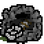
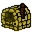
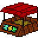
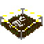

# Pompei 2079 (JS)
Pompei 2079 è un videogioco ambientato nell'antica Pompei, dove la popolazione deve bloccare l'imminente eruzione del Vesuvio fabbricando un tappo di mattoni. Per ottenere il materiale necessario bisogna costruire nei lotti disponibili diversi edifici, ognuno dei quali svolge una funzione specifica:

|Nome                  |Icona                          |Funzione                                                     |
|:--------------------:|:-----------------------------:|:-----------------------------------------------------------:|
|Miniera               |           |Estrae minerali                                              |
|Fornace               |           |Crea mattoni fondendo minerali                               |
|Mercato               |           |Ricava monete vendendo minerali                              |
|"Reperti"             |           |Trova ogni tanto dei manufatti appartenuti all’antica civiltà|
|Tempio della fortuna  |  |Aumenta l’estrazione di minerali da parte di tutte le miniere|
|Tempio della ricchezza||Aumenta il ricavo di tutti i mercati                         |

Il gioco originale è stato creato sulla piattaforma [GameFroot](https://make.gamefroot.com/), con cui è stato [pubblicato](https://storage.googleapis.com/users.gamefroot.com/4767966/game/629474/1682024123745.html), mentre questa è una reimplementazione in JavaScript, più leggera e performante, perché non dipende da [Phaser](https://phaser.io/), il framework che GameFroot usa.
